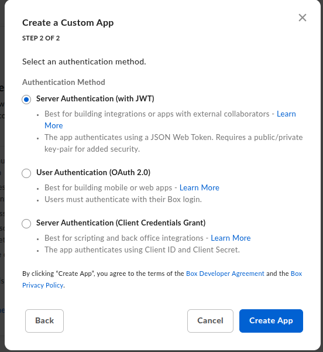
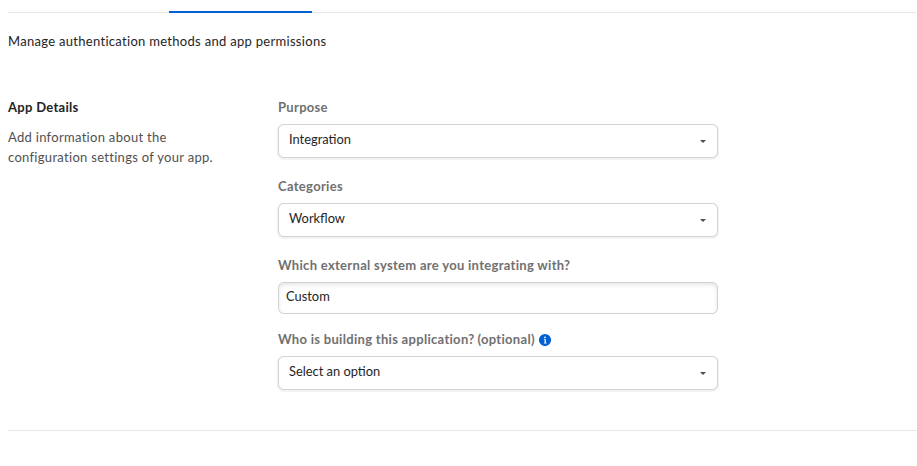
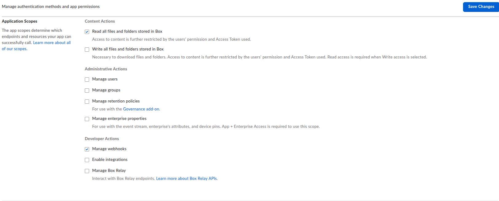

# Box Webhook Demo

An interactive C# console application demonstrating how to programmatically create and manage Box webhooks to listen for folder events, particularly new file uploads.

## Overview

This is the **interactive console UI** for webhook management. It uses the shared `BoxWebhookShared` library for all domain logic, application services, and Box SDK implementations.

For a **CLI tool suitable for CI/CD pipelines**, see [BoxWebhookTool](../BoxWebhookTool/README.md).

## Architecture

This application is built on **Domain-Driven Design (DDD)** and **SOLID** principles by utilizing:

- **BoxWebhookShared**: Core domain entities, application services, and infrastructure (Domain, Application, Infrastructure layers)
- **BoxWebhookDemo.Presentation**: Interactive console UI components
- **BoxWebhookDemo.Infrastructure.OAuth**: OAuth 2.0 callback handler specific to this demo

## Prerequisites

### 1. Box Developer Account

1. Sign up for a Box developer account at [https://developer.box.com](https://developer.box.com)
2. Create a new application in the [Developer Console](https://app.box.com/developers/console)

### 2. Application Configuration

When creating a Custom App, select the appropriate authentication method:







### Required Application Scopes

In the **Configuration** tab under **Application Scopes**, enable the following:

#### Content Actions
| Scope | Required | Description |
|-------|----------|-------------|
| ✅ **Read all files and folders stored in Box** | Yes | Access to content is further restricted by the user's permission and Access Token used |
| ☐ Write all files and folders stored in Box | Optional | Necessary to download files and folders. Read access is required when Write access is selected |

#### Administrative Actions
| Scope | Required | Description |
|-------|----------|-------------|
| ☐ Manage users | No | For user management |
| ☐ Manage groups | No | For group management |
| ☐ Manage retention policies | No | For use with the Governance add-on |
| ☐ Manage enterprise properties | No | For use with the event stream, enterprise's attributes, and device pins. App + Enterprise Access is required |

#### Developer Actions
| Scope | Required | Description |
|-------|----------|-------------|
| ✅ **Manage webhooks** | **Yes** | **Required for this application to create and manage webhooks** |
| ☐ Enable integrations | No | For third-party integrations |
| ☐ Manage Box Relay | No | Interact with Box Relay endpoints |

> **Important**: After changing scopes, click **Save Changes** and ensure your application is re-authorized in the Admin Console if using CCG or JWT authentication.

| Method | Best For | Recommendation |
|--------|----------|----------------|
| **Server Authentication (JWT)** | Apps with external collaborators, complex enterprise setups | More complex setup, requires key pairs |
| **User Authentication (OAuth 2.0)** | Mobile/web apps where users log in | Not suitable for server-side automation |
| **Server Authentication (CCG)** ✅ | Server-to-server integrations, scripting, back office | **Recommended for webhooks** |

**For webhook applications, select "Server Authentication (Client Credentials Grant)"** because:
- Server-to-server communication without user interaction
- Simple setup with just Client ID and Client Secret
- Designed for automation and back-office integrations

In your Box application settings:

1. **Enable "Manage Webhooks" scope** in the Configuration tab
2. Choose your authentication method:
   - **Developer Token** (for testing - expires in 60 minutes)
   - **Client Credentials Grant (CCG)** - recommended for server-to-server
   - **JWT Authentication** - for enterprise applications

3. **Authorize the application** (Admin Console) if using CCG or JWT

### 3. Webhook URL Requirements

Your webhook endpoint must:
- Use **HTTPS** (HTTP is not allowed)
- Be on **port 443**
- Return an HTTP status code in the range **200-299** within **30 seconds**
- Be publicly accessible from the internet

> **Tip**: For testing, use services like [ngrok](https://ngrok.com), [webhook.site](https://webhook.site), or [RequestBin](https://requestbin.com) to create temporary webhook endpoints.

## Installation

```bash
# Navigate to the project directory
cd BoxWebhookDemo

# Restore dependencies
dotnet restore

# Build the project
dotnet build
```

## Running the Application

```bash
dotnet run
```

## Authentication Options

### Option 1: Developer Token (Testing Only)

1. Go to your application in the [Developer Console](https://app.box.com/developers/console)
2. Navigate to the **Configuration** tab
3. Under **Developer Token**, click **Generate Developer Token**
4. Copy the token (valid for 60 minutes)

### Option 2: Client Credentials Grant (CCG)

Set environment variables or enter credentials when prompted:

```bash
# Linux/macOS
export BOX_CLIENT_ID="your_client_id"
export BOX_CLIENT_SECRET="your_client_secret"
export BOX_ENTERPRISE_ID="your_enterprise_id"

# Windows (PowerShell)
$env:BOX_CLIENT_ID="your_client_id"
$env:BOX_CLIENT_SECRET="your_client_secret"
$env:BOX_ENTERPRISE_ID="your_enterprise_id"
```

### Option 3: JWT Authentication

1. Download your JWT config file from the Developer Console (Configuration > App Settings > Download as JSON)
2. Provide the file path when prompted, or base64-encode the config

### Option 4: OAuth 2.0 (User Authentication) ✅ Works with Personal Accounts

OAuth 2.0 is the **recommended method for personal/free Box accounts** as it doesn't require enterprise authorization.

#### Setup Steps

1. **Create an OAuth 2.0 App** in the [Developer Console](https://app.box.com/developers/console):
   - Click **Create New App** → **Custom App**
   - Select **User Authentication (OAuth 2.0)**
   - Name your application

2. **Configure Redirect URI**:
   - Go to **Configuration** tab
   - Under **OAuth 2.0 Redirect URI**, add: `http://localhost:8080/callback`
   - Click **Save Changes**

3. **Enable Required Scopes**:
   - Under **Application Scopes**, enable:
     - ✅ Read all files and folders stored in Box
     - ✅ Manage webhooks

4. **Run the application** and select option **4** (OAuth 2.0):

   ```bash
   dotnet run
   ```

5. **Choose authentication mode**:

   **Option 1: Automatic (Recommended)**
   - The app starts a local HTTP server on port 8080
   - Opens your browser automatically
   - Captures the authorization code automatically
   - No manual copy/paste required!

   **Option 2: Manual**
   - Copy the authorization URL to your browser
   - Authorize the app
   - Copy the `code` parameter from the redirect URL
   - Paste it back into the application

#### Environment Variables (optional)

```bash
# .env file
BOX_CLIENT_ID=your_client_id
BOX_CLIENT_SECRET=your_client_secret
BOX_REDIRECT_URI=http://localhost:8080/callback
```

### Authentication Method Comparison

| Method | Personal Account | Enterprise Account | Setup Complexity |
|--------|------------------|-------------------|------------------|
| Developer Token | ✅ Yes | ✅ Yes | Easy (expires in 60 min) |
| OAuth 2.0 | ✅ Yes | ✅ Yes | Medium (browser flow) |
| CCG | ❌ No | ✅ Yes | Easy (requires admin authorization) |
| JWT | ❌ No | ✅ Yes | Complex (key pairs required) |

## Available Webhook Triggers

### File Events (on Folders)
| Trigger | Description |
|---------|-------------|
| `FILE.UPLOADED` | A file is uploaded or moved to this folder |
| `FILE.PREVIEWED` | A file is previewed |
| `FILE.DOWNLOADED` | A file is downloaded |
| `FILE.TRASHED` | A file is moved to trash |
| `FILE.DELETED` | A file is permanently deleted |
| `FILE.RESTORED` | A file is restored from trash |
| `FILE.COPIED` | A file is copied |
| `FILE.MOVED` | A file is moved from one folder to another |
| `FILE.LOCKED` | A file is locked |
| `FILE.UNLOCKED` | A file is unlocked |
| `FILE.RENAMED` | A file is renamed |

### Folder Events
| Trigger | Description |
|---------|-------------|
| `FOLDER.CREATED` | A folder is created |
| `FOLDER.RENAMED` | A folder is renamed |
| `FOLDER.DOWNLOADED` | A folder is downloaded |
| `FOLDER.RESTORED` | A folder is restored from trash |
| `FOLDER.DELETED` | A folder is permanently removed |
| `FOLDER.COPIED` | A folder is copied |
| `FOLDER.MOVED` | A folder is moved to a different folder |
| `FOLDER.TRASHED` | A folder is moved to trash |

### Other Events
| Trigger | Description |
|---------|-------------|
| `COLLABORATION.CREATED` | A collaboration is created |
| `COLLABORATION.ACCEPTED` | A collaboration is accepted |
| `COLLABORATION.REJECTED` | A collaboration is rejected |
| `COLLABORATION.REMOVED` | A collaboration is removed |
| `COLLABORATION.UPDATED` | A collaboration is updated |
| `COMMENT.CREATED` | A comment is created |
| `COMMENT.UPDATED` | A comment is edited |
| `COMMENT.DELETED` | A comment is removed |
| `METADATA_INSTANCE.CREATED` | A metadata instance is created |
| `METADATA_INSTANCE.UPDATED` | A metadata instance is updated |
| `METADATA_INSTANCE.DELETED` | A metadata instance is deleted |

## Example: Creating a Webhook for File Uploads

```csharp
using Box.Sdk.Gen;
using Box.Sdk.Gen.Managers;

// Authenticate
var auth = new BoxDeveloperTokenAuth(token: "YOUR_DEVELOPER_TOKEN");
var client = new BoxClient(auth: auth);

// Create webhook for file uploads on a specific folder
var target = new CreateWebhookRequestBodyTargetField()
{
    Id = "FOLDER_ID",
    Type = CreateWebhookRequestBodyTargetTypeField.Folder
};

var triggers = Array.AsReadOnly(new[] 
{ 
    new StringEnum<CreateWebhookRequestBodyTriggersField>(
        CreateWebhookRequestBodyTriggersField.FileUploaded
    )
});

var requestBody = new CreateWebhookRequestBody(
    target: target,
    address: "https://your-webhook-endpoint.com/webhook",
    triggers: triggers
);

var webhook = await client.Webhooks.CreateWebhookAsync(requestBody: requestBody);
Console.WriteLine($"Webhook created with ID: {webhook.Id}");
```

## Webhook Payload Example

When a file is uploaded, Box sends a POST request to your webhook URL with a payload like:

```json
{
  "type": "webhook_event",
  "id": "event_id",
  "created_at": "2024-01-01T12:00:00-00:00",
  "trigger": "FILE.UPLOADED",
  "webhook": {
    "id": "webhook_id",
    "type": "webhook"
  },
  "created_by": {
    "type": "user",
    "id": "user_id",
    "name": "User Name",
    "login": "user@example.com"
  },
  "source": {
    "type": "file",
    "id": "file_id",
    "name": "uploaded_file.pdf",
    "parent": {
      "type": "folder",
      "id": "folder_id",
      "name": "Folder Name"
    }
  }
}
```

## Webhook Signature Verification

Box includes signature headers for verifying webhook authenticity:

- `BOX-SIGNATURE-PRIMARY`: Primary signature
- `BOX-SIGNATURE-SECONDARY`: Secondary signature (optional)
- `BOX-DELIVERY-ID`: Unique delivery ID
- `BOX-DELIVERY-TIMESTAMP`: Timestamp of the delivery

Verify signatures using your application's primary and secondary keys from the Developer Console.

## Important Notes

1. **Webhooks cascade**: If you set a webhook on a parent folder, it will also monitor sub-folders
2. **Webhook ownership**: Webhooks are owned by a user - if that user is deleted, webhooks may fail
3. **Port 443 only**: Webhook URLs must use standard HTTPS port 443
4. **Response time**: Your endpoint must respond within 30 seconds
5. **Retry mechanism**: Box will retry failed deliveries with exponential backoff

## Troubleshooting

### Common Issues

1. **403 Forbidden**: Ensure "Manage Webhooks" scope is enabled and the application is authorized
2. **Webhook not receiving events**: Verify the URL is publicly accessible and returns 2xx status
3. **Invalid target**: The folder ID must exist and be accessible to the authenticated user
4. **Authentication errors**: Verify credentials and ensure the application is properly configured

## Resources

- [Box Developer Documentation](https://developer.box.com)
- [Webhook Guides](https://developer.box.com/guides/webhooks/)
- [Box .NET SDK](https://github.com/box/box-windows-sdk-v2)
- [API Reference](https://developer.box.com/reference/)

## License

MIT License
